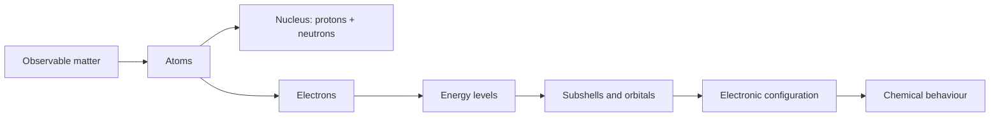
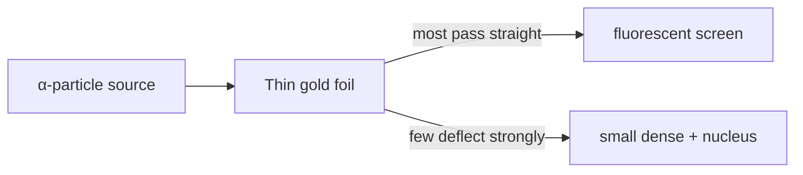

# ⚛️ Class 11 Chemistry — Digital Learning Book
## From Zero to Advanced: **Structure of Atom & Electronic Configuration**

> **Audience:** A learner starting chemistry from scratch (Class 11 / senior secondary).
>
> **How to use this chapter:** Read the blue-style callouts first, work through every solved example without looking at the answer, then attempt the 50-question practice set. This is a *complete foundational chapter*, designed as the starting point for the rest of Class 11 Chemistry.

---

## 📚 Contents

1. [Learning map](#-learning-map)
2. [Matter, atoms and the big picture](#1-matter-atoms-and-the-big-picture)
3. [Subatomic particles and atomic notation](#2-subatomic-particles-and-atomic-notation)
4. [Isotopes, isobars and isotones](#3-isotopes-isobars-and-isotones)
5. [How we discovered the atom](#4-how-we-discovered-the-atom)
6. [Electromagnetic radiation](#5-electromagnetic-radiation)
7. [Bohr model](#6-bohrs-model-of-the-hydrogen-atom)
8. [Quantum-mechanical model and orbitals](#7-quantum-mechanical-model-and-orbitals)
9. [Quantum numbers and electronic configuration](#8-quantum-numbers-and-electronic-configuration)
10. [Revision toolkit](#9-revision-toolkit)
11. [Solved examples](#10-solved-examples)
12. [Practice set: 50 questions](#11-practice-set--50-questions)
13. [Answer key and explanations](#12-answer-key--explanations)

---

## 🧭 Learning map



> 💡 **Core idea:** Chemistry is largely the story of **electrons**: where they are, how much energy they have, and how they rearrange.

---

# 1. Matter, atoms and the big picture

Everything that occupies space and has mass is called **matter**. Matter is made of extremely small particles. An **atom** is the smallest particle of an element that retains the chemical identity of that element.

| Term | Meaning | Example |
|---|---|---|
| Element | Substance made of one kind of atom | Oxygen, \(\mathrm{O}\) |
| Atom | One particle of an element | one oxygen atom |
| Molecule | Two or more atoms chemically bonded | \(\mathrm{O_2}\), \(\mathrm{H_2O}\) |
| Ion | Charged atom or group of atoms | \(\mathrm{Na^+}\), \(\mathrm{Cl^-}\) |

### Atom: a visual introduction


*An atom-model illustration. The modern model is more subtle than electrons travelling in fixed circular paths; that distinction becomes important later.* Image: [Wikimedia Commons](https://commons.wikimedia.org/wiki/File:Bohr_atom_model_English.png)

> ⚠️ **Do not imagine atoms as little solar systems.** The Bohr picture is useful for hydrogen and basic energy calculations, but electrons in modern chemistry are described by probability clouds called **orbitals**.

---

# 2. Subatomic particles and atomic notation

Atoms contain three main subatomic particles.

| Particle | Symbol | Charge | Relative mass | Location |
|---|---:|---:|---:|---|
| Electron | \(e^-\) | \(-1\) | \(\frac{1}{1836}\) u | outside nucleus |
| Proton | \(p^+\) | \(+1\) | \(\approx 1\) u | nucleus |
| Neutron | \(n^0\) | \(0\) | \(\approx 1\) u | nucleus |

Here, **u** (unified atomic mass unit) is approximately \(1.6605\times10^{-27}\,\mathrm{kg}\).

## 2.1 Atomic number and mass number

For an atom written as

\[
{}^{A}_{Z}\mathrm{X}
\]

- \(\mathrm{X}\) = chemical symbol
- \(Z\) = **atomic number** = number of protons
- \(A\) = **mass number** = protons + neutrons

Therefore,

\[
\boxed{\text{number of neutrons}=A-Z}
\]

For a neutral atom,

\[
\boxed{\text{number of electrons}=Z}
\]

For an ion with charge \(q\), use the practical rule:

\[
\text{electrons} = Z - (\text{positive charge}) \quad\text{or}\quad Z + (\text{magnitude of negative charge})
\]

### Example: decode \({}^{35}_{17}\mathrm{Cl^-}\)

- Protons = \(17\)
- Neutrons = \(35-17=18\)
- Electrons = \(17+1=18\), because a \(-1\) ion has gained one electron.

> 🧠 **Memory trick:** `A = All nucleons` (protons + neutrons); `Z = proton ZIP code` (it fixes the element’s identity).

---

# 3. Isotopes, isobars and isotones

These look similar, so learn them by comparing what stays the same.

| Name | Same | Different | Example | One-line memory hook |
|---|---|---|---|---|
| **Isotopes** | atomic number \(Z\) | mass number \(A\) | \({}^{35}\mathrm{Cl}\), \({}^{37}\mathrm{Cl}\) | *iso-tope*: same place in periodic table |
| **Isobars** | mass number \(A\) | atomic number \(Z\) | \({}^{40}_{18}\mathrm{Ar}\), \({}^{40}_{20}\mathrm{Ca}\) | *bar* = same total mass |
| **Isotones** | neutrons \((A-Z)\) | \(Z\) | \({}^{14}_{6}\mathrm C\), \({}^{15}_{7}\mathrm N\) | *tone* = same neutron “tone” |

## 3.1 Average atomic mass

The mass printed on a periodic table is usually a **weighted average**, because natural elements are mixtures of isotopes.

\[
\boxed{\text{Average atomic mass}=\sum(\text{fractional abundance}\times\text{isotopic mass})}
\]

If abundance is given as a percentage, divide by \(100\) first.

### Why isotopes have nearly identical chemistry
Chemical reactions depend mainly on the electron arrangement. Isotopes of one element have the same \(Z\), so neutral isotopes have the same number of electrons. Their masses differ, not their ordinary chemical identity.

---

# 4. How we discovered the atom

## 4.1 Important experiments at a glance

| Scientist | Experiment / observation | Conclusion |
|---|---|---|
| J. J. Thomson | Cathode rays bend toward a positive plate | Electron exists and is negative |
| R. A. Millikan | Oil-drop experiment | Charge on electron = \(1.602\times10^{-19}\,\mathrm C\) |
| E. Rutherford | Gold-foil \(\alpha\)-scattering | Tiny, dense, positive nucleus; mostly empty space |
| N. Bohr | Hydrogen spectrum | Electron energies are quantised |
| J. Chadwick | Beryllium radiation experiment | Neutron exists |

## 4.2 Rutherford’s gold foil experiment

**Observation:** Most \(\alpha\)-particles passed straight through gold foil. A few deflected; an extremely small number bounced back.



**Conclusions**

1. Most of the atom is empty space.
2. Almost all mass and all positive charge lie in a tiny nucleus.
3. Electrons occupy the remaining space.

### Limits of Rutherford’s model

| Success | Limitation |
|---|---|
| Explained nuclear atom | Could not explain why orbiting electrons do not lose energy and collapse |
| Explained large-angle scattering | Could not explain line spectra |

> 🔍 **Exam phrase:** Never say “the atom is solid.” Rutherford showed that **most of its volume is empty space**.

---

# 5. Electromagnetic radiation

Light has both **wave-like** and **particle-like** behaviour. The full range is the electromagnetic spectrum.

```text
Long wavelength / low frequency / low energy                         Short wavelength / high frequency / high energy
Radio ─ Microwaves ─ Infrared ─ Visible ─ Ultraviolet ─ X-rays ─ Gamma rays
```

## 5.1 Wave vocabulary

| Quantity | Symbol | SI unit | Meaning |
|---|---:|---:|---|
| Wavelength | \(\lambda\) | m | Distance between matching points of adjacent waves |
| Frequency | \(\nu\) | \(\mathrm{s^{-1}}\) or Hz | Number of wave cycles per second |
| Wave number | \(\bar\nu\) | \(\mathrm{m^{-1}}\) | Number of waves per metre |
| Speed of light | \(c\) | \(\mathrm{m\,s^{-1}}\) | \(2.998\times10^8\,\mathrm{m\,s^{-1}}\) in vacuum |

The central wave relationship is

\[
\boxed{c=\lambda\nu}
\]

Thus \(\lambda\) and \(\nu\) are **inversely proportional**: if wavelength doubles, frequency halves.

## 5.2 Planck’s quantum idea

Energy is emitted or absorbed in small packets, **quanta**. For light, one quantum is a **photon**.

\[
\boxed{E=h\nu=\frac{hc}{\lambda}}
\]

where \(h=6.626\times10^{-34}\,\mathrm{J\,s}\) is Planck’s constant.

| Property increases when… | Reason |
|---|---|
| Frequency \(\nu\) increases | \(E=h\nu\) |
| Wavelength \(\lambda\) decreases | \(E=hc/\lambda\) |
| Photon energy increases | radiation becomes more capable of electronic excitation/ionisation |

> 🧠 **Memory triangle:** \(E\uparrow\Rightarrow\nu\uparrow\Rightarrow\lambda\downarrow\). Read it as “energy and frequency are friends; wavelength goes the other way.”

## 5.3 Photoelectric effect

A metal emits electrons only when light of sufficiently high **frequency** falls on it. Making low-frequency light brighter does *not* work. This supports the photon idea: each electron needs one photon with enough energy.

---

# 6. Bohr’s model of the hydrogen atom

Bohr proposed that an electron in hydrogen can exist only in allowed stationary energy states \(n=1,2,3,\ldots\).

## 6.1 Bohr postulates

1. Electrons move only in certain permitted circular orbits without radiating energy.
2. Each orbit has a fixed energy.
3. Radiation is absorbed/emitted only when an electron changes level.

\[
\boxed{\Delta E=E_\text{final}-E_\text{initial}=h\nu}
\]

- Going **up** a level: \(\Delta E>0\), absorption.
- Going **down** a level: \(\Delta E<0\), emission; the photon has energy \(|\Delta E|\).

## 6.2 Energy of a hydrogen-like species

For one-electron species such as \(\mathrm H\), \(\mathrm{He^+}\), \(\mathrm{Li^{2+}}\):

\[
\boxed{E_n=-2.18\times10^{-18}\frac{Z^2}{n^2}\ \mathrm J\,\text{per atom}}
\]

or

\[
\boxed{E_n=-13.6\frac{Z^2}{n^2}\ \mathrm{eV\,per\ electron}}
\]

where \(Z\) is nuclear charge and \(n\) is principal quantum number.

### Meaning of the negative sign

Zero energy is defined for an electron infinitely far from the nucleus. A bound electron has lower energy than this reference, hence negative energy. To remove it completely, energy must be supplied.

\[
\boxed{\text{Ionisation energy from level }n=+2.18\times10^{-18}\frac{Z^2}{n^2}\ \mathrm J}
\]

## 6.3 Hydrogen spectral series

| Series | Final level \(n_f\) | Region |
|---|---:|---|
| Lyman | 1 | ultraviolet |
| Balmer | 2 | visible / near UV |
| Paschen | 3 | infrared |
| Brackett | 4 | infrared |
| Pfund | 5 | infrared |

\[
\boxed{\frac{1}{\lambda}=R_H\left(\frac{1}{n_f^2}-\frac{1}{n_i^2}\right),\quad n_i>n_f}
\]

Here \(R_H\approx1.097\times10^7\,\mathrm{m^{-1}}\).

### Bohr model: advantages and disadvantages

| Advantages ✅ | Disadvantages ⚠️ |
|---|---|
| Explains stability and line spectrum of hydrogen | Fails for multi-electron atoms |
| Gives correct energies for hydrogen-like ions | Cannot explain fine spectral splitting, Zeeman effect or electron wave nature |
| Introduces quantised energy levels clearly | Fixed circular paths contradict modern uncertainty principle |

---

# 7. Quantum-mechanical model and orbitals

## 7.1 de Broglie: matter waves

If light can behave as particles, particles can behave as waves.

\[
\boxed{\lambda=\frac{h}{mv}}
\]

A fast/heavy object has an extremely tiny wavelength; an electron has a measurable wave nature.

## 7.2 Heisenberg uncertainty principle

It is impossible to know both exact position and exact momentum simultaneously:

\[
\boxed{\Delta x\,\Delta p\geq\frac{h}{4\pi}}
\]

This is not a measurement defect. It is a property of nature at atomic scale.

## 7.3 Orbit versus orbital

| Orbit | Orbital |
|---|---|
| Bohr’s fixed circular path | 3D region where probability of finding electron is high |
| Has definite radius and path | Has shape, size and orientation |
| Old model | Modern quantum model |
| Can be thought of as one track | Can hold at most 2 electrons |

> ⭐ **High-yield statement:** An orbital is **not a path**. It is a mathematical probability region around the nucleus.

## 7.4 Orbital shapes and capacities

| Subshell | \(l\) | Number of orbitals \(2l+1\) | Maximum electrons | General shape |
|---|---:|---:|---:|---|
| s | 0 | 1 | 2 | spherical |
| p | 1 | 3 | 6 | dumbbell-like |
| d | 2 | 5 | 10 | mostly clover-like |
| f | 3 | 7 | 14 | complex |

```text
s:      ●             p:       ( )—●—( )
                               x, y, z orientations
```

### Nodes (advanced enrichment)

A **node** is a region of zero probability of finding an electron.

\[
\text{Total nodes}=n-1
\]
\[
\text{Angular nodes}=l
\]
\[
\text{Radial nodes}=n-l-1
\]

For \(3p\): total \(=2\), angular \(=1\), radial \(=3-1-1=1\).

---

# 8. Quantum numbers and electronic configuration

## 8.1 The four quantum numbers

An electron in an atom is described by four quantum numbers.

| Number | Symbol | Allowed values | It tells us |
|---|---:|---|---|
| Principal | \(n\) | \(1,2,3,\ldots\) | shell; size and approximate energy |
| Azimuthal / angular momentum | \(l\) | \(0\) to \(n-1\) | subshell shape: \(0=s,1=p,2=d,3=f\) |
| Magnetic | \(m_l\) | \(-l\) to \(+l\) | orbital orientation |
| Spin | \(m_s\) | \(+\frac12\), \(-\frac12\) | electron spin |

### Allowed sets: quick check
For \(n=3\), \(l\) can only be \(0,1,2\). Therefore 3s, 3p and 3d exist; **3f does not**.

## 8.2 How many electrons fit?

| Location | Formula | Example |
|---|---|---|
| One orbital | \(2\) | one 2p orbital holds 2 |
| A subshell | \(2(2l+1)\) | p: \(2(3)=6\) |
| Shell \(n\) | \(2n^2\) | \(n=3\): \(18\) |
| Orbitals in shell \(n\) | \(n^2\) | \(n=3\): \(9\) |

## 8.3 The three filling rules

### 1. Aufbau principle — fill low energy first
Use the \(n+l\) rule. Lower \(n+l\) fills first. If tied, lower \(n\) fills first.

```text
1s
2s  2p
3s  3p  3d
4s  4p  4d  4f
5s  5p  5d  5f

Filling order: 1s → 2s → 2p → 3s → 3p → 4s → 3d → 4p → 5s → 4d → 5p → 6s → 4f → 5d → 6p → 7s
```

### 2. Pauli exclusion principle — no identical four-number address
No two electrons in an atom can have the same set of all four quantum numbers. Therefore one orbital holds at most two electrons with opposite spins.

### 3. Hund’s rule — occupy empty equal-energy orbitals first
In a group of degenerate orbitals, electrons spread out singly with parallel spins before pairing.

```text
Nitrogen, 1s² 2s² 2p³
2p:  [↑] [↑] [↑]      correct
2p:  [↑↓] [↑] [ ]     not lowest-energy arrangement
```

> 🧠 **Filling-rule mnemonic:** **A–P–H** = *Aufbau fills first; Pauli pairs oppositely; Hund hates pairing early.*

## 8.4 Electronic configuration examples

| Atom / ion | Electrons | Full configuration | Noble-gas shorthand |
|---|---:|---|---|
| H | 1 | \(1s^1\) | \(1s^1\) |
| C | 6 | \(1s^2\,2s^2\,2p^2\) | \([\mathrm{He}]\,2s^2 2p^2\) |
| O | 8 | \(1s^2\,2s^2\,2p^4\) | \([\mathrm{He}]\,2s^2 2p^4\) |
| Na | 11 | \(1s^2\,2s^2\,2p^6\,3s^1\) | \([\mathrm{Ne}]\,3s^1\) |
| \(\mathrm{Cl^-}\) | 18 | \(1s^2\,2s^2\,2p^6\,3s^2\,3p^6\) | \([\mathrm{Ar}]\) |
| \(\mathrm{Fe}\) | 26 | \([\mathrm{Ar}]\,4s^2 3d^6\) | same |

### Ions: the common trap
For transition-metal cations, remove electrons from the **highest principal shell \(n\)** first, not from the subshell written last.

\[
\mathrm{Fe}: [Ar]4s^2 3d^6
\]
\[
\mathrm{Fe^{2+}}: [Ar]3d^6 \quad \text{(remove 4s electrons first)}
\]

## 8.5 Stability exceptions: chromium and copper
A half-filled or fully filled d subshell is especially stable.

\[
\mathrm{Cr}: [Ar]3d^5 4s^1 \quad \text{not }[Ar]3d^4 4s^2
\]
\[
\mathrm{Cu}: [Ar]3d^{10}4s^1 \quad \text{not }[Ar]3d^9 4s^2
\]

---

# 9. Revision toolkit

## 9.1 Formula sheet

\[
A=Z+N \qquad N=A-Z
\]
\[
c=\lambda\nu
\]
\[
E=h\nu=\frac{hc}{\lambda}
\]
\[
\lambda=\frac{h}{mv}
\]
\[
E_n=-2.18\times10^{-18}\frac{Z^2}{n^2}\ \mathrm J
\]
\[
\frac{1}{\lambda}=R_H\left(\frac{1}{n_f^2}-\frac{1}{n_i^2}\right)
\]
\[
\text{maximum electrons in shell}=2n^2
\]

## 9.2 Common mistakes — and the repair

| Mistake | Repair |
|---|---|
| Calling an orbital an electron path | Say “probability region” |
| Using mass number as periodic-table mass | Mass number is for one isotope; atomic mass is a weighted average |
| Forgetting ion charge when counting electrons | Positive ion = lost electrons; negative ion = gained electrons |
| Writing \(3f\) | For \(n=3\), only \(l=0,1,2\): s, p, d |
| Pairing 2p electrons before each p orbital has one electron | Apply Hund’s rule |
| Removing 3d before 4s in \(\mathrm{Fe^{2+}}\) | Remove largest \(n\) first: 4s |

## 9.3 One-minute recall cards

- **What fixes the identity of an element?** Number of protons, \(Z\).
- **Which isotopic property changes?** Number of neutrons.
- **Highest-energy visible colour?** Violet (shorter \(\lambda\)).
- **Can a p subshell hold?** 6 electrons.
- **Can a 3p electron have \(l=2\)?** No; p means \(l=1\).
- **What does an emission spectrum mean?** Electron fell to a lower energy level.

---

# 10. Solved examples

## Example 1 — particles in an ion
**Question.** Find the numbers of protons, neutrons and electrons in \({}^{56}_{26}\mathrm{Fe^{3+}}\).

**Solution.**

\[
p=Z=26
\]
\[
n=A-Z=56-26=30
\]

The \(3+\) charge means three electrons were lost:

\[
e=26-3=23
\]

\[
\boxed{p=26,\;n=30,\;e=23}
\]

---

## Example 2 — average atomic mass
**Question.** An element has isotopes of mass 10.0 u (20%) and 11.0 u (80%). Find its average atomic mass.

**Solution.**

\[
\bar m=(0.20)(10.0)+(0.80)(11.0)
\]
\[
\bar m=2.0+8.8=10.8\ \mathrm u
\]

\[
\boxed{10.8\ \mathrm u}
\]

---

## Example 3 — frequency from wavelength
**Question.** Find frequency of light of wavelength \(600\,\mathrm{nm}\).

**Solution.** Convert first:

\[
600\,\mathrm{nm}=600\times10^{-9}\,\mathrm m=6.00\times10^{-7}\,\mathrm m
\]

\[
\nu=\frac{c}{\lambda}=\frac{2.998\times10^8}{6.00\times10^{-7}}
=5.00\times10^{14}\,\mathrm{s^{-1}}
\]

\[
\boxed{5.00\times10^{14}\,\mathrm{Hz}}
\]

---

## Example 4 — photon energy
**Question.** Calculate the energy of one photon of \(400\,\mathrm{nm}\) light.

**Solution.**

\[
E=\frac{hc}{\lambda}
=\frac{(6.626\times10^{-34})(2.998\times10^8)}{400\times10^{-9}}
\]
\[
E=4.97\times10^{-19}\,\mathrm J
\]

\[
\boxed{4.97\times10^{-19}\,\mathrm J\,photon^{-1}}
\]

**Check:** blue/violet-ish light has a shorter wavelength than red light, so its photon energy should be relatively high. Correct.

---

## Example 5 — Bohr transition in hydrogen
**Question.** Calculate \(\Delta E\) for hydrogen electron transition \(n=1\to n=3\). Is energy absorbed or emitted?

**Solution.**

\[
E_1=-2.18\times10^{-18}\,\mathrm J
\]
\[
E_3=-2.18\times10^{-18}\left(\frac{1}{9}\right)=-2.42\times10^{-19}\,\mathrm J
\]
\[
\Delta E=E_3-E_1=(-2.42\times10^{-19})-(-2.18\times10^{-18})
\]
\[
\Delta E=+1.94\times10^{-18}\,\mathrm J
\]

\[
\boxed{\Delta E=+1.94\times10^{-18}\,\mathrm J;\ \text{absorption}}
\]

---

## Example 6 — quantum numbers
**Question.** How many orbitals are in the \(n=4\) shell? What is the maximum number of electrons in it?

**Solution.**

\[
\text{orbitals}=n^2=4^2=16
\]
\[
\text{electrons}=2n^2=2(4^2)=32
\]

\[
\boxed{16\text{ orbitals};\ 32\text{ electrons}}
\]

---

## Example 7 — configuration and unpaired electrons
**Question.** Write the electronic configuration of \(\mathrm{O}\) and count unpaired electrons.

**Solution.** Oxygen has \(Z=8\):

\[
\mathrm O:1s^2\,2s^2\,2p^4
\]

Orbital picture:

```text
1s [↑↓]   2s [↑↓]   2p [↑↓][↑][↑]
```

\[
\boxed{2\text{ unpaired electrons}}
\]

---

## Example 8 — a transition-metal ion
**Question.** Write the configuration of \(\mathrm{Fe^{3+}}\).

**Solution.** Neutral Fe: \([\mathrm{Ar}]4s^2 3d^6\). Remove from highest \(n\), so remove two 4s electrons, then one 3d electron.

\[
\boxed{\mathrm{Fe^{3+}}:[\mathrm{Ar}]3d^5}
\]

---

# 11. Practice set — 50 questions

> **Attempt first.** Answers and short explanations are below. Use \(c=3.00\times10^8\,\mathrm{m\,s^{-1}}\) and \(h=6.626\times10^{-34}\,\mathrm{J\,s}\), unless stated otherwise.

## A. Foundations and atomic structure (1–15)

1. **MCQ.** The atomic number of an atom equals its number of: (A) neutrons (B) protons (C) nucleons (D) electrons in every ion.
2. **MCQ.** \({}^{23}_{11}\mathrm{Na^+}\) contains: (A) 11 e\(^-\), 12 n\(^0\) (B) 10 e\(^-\), 12 n\(^0\) (C) 12 e\(^-\), 11 n\(^0\) (D) 10 e\(^-\), 11 n\(^0\).
3. **MCQ.** Isotopes have the same: (A) mass number (B) neutron number (C) atomic number (D) atomic mass.
4. **MCQ.** Which pair is isobaric? (A) \({}^{35}_{17}\mathrm{Cl}\), \({}^{37}_{17}\mathrm{Cl}\) (B) \({}^{40}_{18}\mathrm{Ar}\), \({}^{40}_{20}\mathrm{Ca}\) (C) \({}^{14}_{6}\mathrm C\), \({}^{15}_{7}\mathrm N\) (D) \({}^{23}_{11}\mathrm{Na}\), \({}^{24}_{12}\mathrm{Mg}\).
5. **MCQ.** Rutherford’s experiment established that: (A) electrons are positive (B) nuclei are diffuse (C) atom is mostly empty space (D) energy is continuous.
6. **Short answer.** State the number of protons, neutrons and electrons in \({}^{31}_{15}\mathrm{P^{3-}}\).
7. **Short answer.** Distinguish mass number from relative atomic mass in two statements.
8. **Numerical.** An element has 75% isotope X-35 and 25% isotope X-37. Calculate average atomic mass.
9. **MCQ.** Which particle has no charge? (A) electron (B) proton (C) neutron (D) positron.
10. **MCQ.** The experiment that measured electron charge was: (A) gold foil (B) oil drop (C) cathode ray (D) alpha spectrum.
11. **Short answer.** Why can two isotopes have nearly identical chemical properties?
12. **MCQ.** \({}^{14}_{6}\mathrm C\) and \({}^{15}_{7}\mathrm N\) are: (A) isotopes (B) isobars (C) isotones (D) isoelectronic.
13. **Short answer.** Define nucleons.
14. **MCQ.** An ion \(\mathrm{X^{2-}}\) has 18 electrons. Atomic number of X is: (A) 16 (B) 18 (C) 20 (D) 16 or 20.
15. **Challenge.** An ion \({}^{A}_{Z}\mathrm X^{2+}\) contains 18 electrons and 22 neutrons. Find \(Z\) and \(A\).

## B. Radiation and Bohr model (16–30)

16. **MCQ.** The relation between wavelength and frequency is: (A) \(\lambda\nu=h\) (B) \(c=\lambda\nu\) (C) \(E=mc^2\) (D) \(\lambda=c\nu\).
17. **MCQ.** Which has greatest photon energy? (A) radio (B) infrared (C) visible red (D) ultraviolet.
18. **MCQ.** If frequency doubles, photon energy: (A) halves (B) doubles (C) stays same (D) becomes zero.
19. **Numerical.** Find wavelength of radiation with \(\nu=6.00\times10^{14}\,\mathrm{Hz}\).
20. **Numerical.** Find energy of one photon of frequency \(5.00\times10^{14}\,\mathrm{Hz}\).
21. **MCQ.** A hydrogen electron falling from \(n=4\) to \(n=2\) undergoes: (A) absorption (B) emission (C) ionisation (D) no energy change.
22. **MCQ.** The Balmer series ends at: (A) \(n=1\) (B) \(n=2\) (C) \(n=3\) (D) infinity.
23. **Short answer.** Explain the negative sign in the Bohr energy expression.
24. **Numerical.** For H atom, calculate \(E_2\) in joules.
25. **Numerical.** How much energy is needed to ionise H from \(n=2\)?
26. **MCQ.** Bohr model works best for: (A) Na (B) \(\mathrm{H}\) (C) \(\mathrm{Cl^-}\) (D) \(\mathrm{Ca}\).
27. **Short answer.** Give one success and one limitation of Bohr model.
28. **MCQ.** Photon energy is inversely proportional to: (A) frequency (B) wavelength (C) Planck constant (D) speed of light.
29. **Numerical.** Calculate frequency of a \(300\,\mathrm{nm}\) photon.
30. **Challenge.** Which transition in H gives the longest-wavelength emitted photon: \(3\to2\), \(4\to2\), or \(5\to2\)? Explain.

## C. Quantum model and configuration (31–50)

31. **MCQ.** An orbital is best described as: (A) circular path (B) region of high probability (C) electron itself (D) shell only.
32. **MCQ.** Number of orbitals in a p subshell: (A) 1 (B) 2 (C) 3 (D) 5.
33. **MCQ.** Maximum electrons in a d subshell: (A) 2 (B) 6 (C) 10 (D) 14.
34. **MCQ.** Which set is impossible? (A) \(n=2,l=1\) (B) \(n=3,l=2\) (C) \(n=3,l=3\) (D) \(n=4,l=0\).
35. **MCQ.** Values of \(m_l\) for \(l=2\) are: (A) 0,1,2 (B) \(-2,-1,0,+1,+2\) (C) \(-1,0,+1\) (D) \(-2,+2\).
36. **Short answer.** State Pauli exclusion principle.
37. **Short answer.** State Hund’s rule.
38. **Numerical.** Maximum electrons in \(n=5\) shell?
39. **Numerical.** How many radial nodes does 4s have?
40. **Numerical.** How many total nodes does 4d have?
41. **MCQ.** Correct configuration of nitrogen is: (A) \(1s^2 2s^2 2p^3\) (B) \(1s^2 2s^2 2p^4\) (C) \(1s^2 2s^2 2p^2\) (D) \(1s^2 2p^5\).
42. **Short answer.** Write configuration of \(\mathrm{Mg^{2+}}\).
43. **Short answer.** Write configuration of \(\mathrm{S^{2-}}\).
44. **MCQ.** Number of unpaired electrons in ground-state carbon is: (A) 0 (B) 1 (C) 2 (D) 4.
45. **MCQ.** Number of unpaired electrons in ground-state oxygen is: (A) 0 (B) 1 (C) 2 (D) 4.
46. **MCQ.** Correct configuration of chromium is: (A) \([Ar]3d^4 4s^2\) (B) \([Ar]3d^5 4s^1\) (C) \([Ar]3d^6\) (D) \([Ar]3d^{10}4s^1\).
47. **Short answer.** Write configuration of \(\mathrm{Fe^{2+}}\).
48. **MCQ.** The first electrons removed from Fe on forming \(\mathrm{Fe^{2+}}\) come from: (A) 1s (B) 3d (C) 4s (D) 3p.
49. **Challenge.** How many orbitals and maximum electrons are present in the \(n=4\) shell?
50. **Challenge.** An electron has \(n=4\), \(l=1\). Identify its subshell; list all allowed \(m_l\) values; state the maximum electrons in this subshell.

---

# 12. Answer key & explanations

<details><summary><strong>Show answers 1–15</strong></summary>

1. **B.** Atomic number is proton count.
2. **B.** \(n=23-11=12\); \(\mathrm{Na^+}\) has \(11-1=10\) electrons.
3. **C.** Same \(Z\), different neutron counts.
4. **B.** Same \(A=40\), different \(Z\).
5. **C.** Most alpha particles passed through.
6. \(p=15\), \(n=31-15=16\), \(e=15+3=18\).
7. **Mass number** = whole-number \(p+n\) for one isotope. **Relative atomic mass** = weighted mean of naturally occurring isotopic masses.
8. \((0.75)(35)+(0.25)(37)=35.5\,\mathrm u\).
9. **C.** neutron.
10. **B.** Millikan oil-drop experiment.
11. They have the same atomic number and hence (when neutral) same electron configuration; chemistry is chiefly controlled by electrons.
12. **C.** Both have \(8\) neutrons.
13. Protons and neutrons, the particles in the nucleus.
14. **A.** \(Z+2=18\Rightarrow Z=16\).
15. \(Z-2=18\Rightarrow Z=20\); \(A=Z+n=20+22=42\).
</details>

<details><summary><strong>Show answers 16–30</strong></summary>

16. **B.** \(c=\lambda\nu\).
17. **D.** UV has shortest wavelength and highest frequency among choices.
18. **B.** \(E=h\nu\).
19. \(\lambda=c/\nu=(3.00\times10^8)/(6.00\times10^{14})=5.00\times10^{-7}\,\mathrm m=500\,\mathrm{nm}\).
20. \(E=h\nu=(6.626\times10^{-34})(5.00\times10^{14})=3.31\times10^{-19}\,\mathrm J\).
21. **B.** A downward transition emits a photon.
22. **B.** Balmer ends at \(n_f=2\).
23. It means the electron is bound and has lower energy than a free electron at infinite distance, chosen as zero.
24. \(E_2=-2.18\times10^{-18}/4=-5.45\times10^{-19}\,\mathrm J\).
25. \(+5.45\times10^{-19}\,\mathrm J\) per atom.
26. **B.** Hydrogen is one-electron.
27. Success: explains H line spectrum. Limitation: fails for multi-electron atoms. (Other valid pairs accepted.)
28. **B.** \(E=hc/\lambda\).
29. \(\nu=c/\lambda=(3.00\times10^8)/(300\times10^{-9})=1.00\times10^{15}\,\mathrm{Hz}\).
30. **\(3\to2\).** It has the smallest energy drop, so it emits the lowest-energy photon and therefore longest \(\lambda\).
</details>

<details><summary><strong>Show answers 31–50</strong></summary>

31. **B.** A probability region.
32. **C.** \(2l+1=3\) for \(l=1\).
33. **C.** 5 orbitals × 2 = 10.
34. **C.** For \(n=3\), \(l\) must be 0, 1 or 2.
35. **B.** \(m_l=-l\) to \(+l\).
36. No two electrons in an atom can have the same four quantum numbers; an orbital holds at most two opposite-spin electrons.
37. Equal-energy orbitals fill singly with parallel spins before pairing begins.
38. \(2n^2=2(25)=50\).
39. Radial nodes \(=n-l-1=4-0-1=3\).
40. Total nodes \(=n-1=3\).
41. **A.** Nitrogen has 7 electrons.
42. \(\mathrm{Mg^{2+}}:[Ne]=1s^2 2s^2 2p^6\).
43. \(\mathrm{S^{2-}}:[Ar]=1s^2 2s^2 2p^6 3s^2 3p^6\).
44. **C.** Carbon 2p\(^2\): two singly occupied p orbitals.
45. **C.** Oxygen 2p\(^4\): two unpaired after one pair forms.
46. **B.** Half-filled \(3d^5\) stability.
47. \(\mathrm{Fe^{2+}}:[Ar]3d^6\).
48. **C.** Remove 4s (highest \(n\)) first.
49. \(n^2=16\) orbitals; \(2n^2=32\) electrons.
50. **4p**; \(m_l=-1,0,+1\); maximum 6 electrons.
</details>

---

# 🎯 Mastery checklist

Mark each only after you can do it without notes.

- [ ] I can calculate protons, neutrons and electrons for atoms and ions.
- [ ] I can distinguish isotopes, isobars and isotones with examples.
- [ ] I can convert between \(\lambda\), \(\nu\), and photon energy with correct units.
- [ ] I can explain absorption vs emission using energy levels.
- [ ] I can state where Bohr model succeeds and fails.
- [ ] I can distinguish orbit from orbital.
- [ ] I can use four quantum numbers and reject impossible sets.
- [ ] I can write configurations, orbital diagrams and configurations of common ions.

---

## 📌 Further study pathway

After mastering this chapter, study in this order: **Periodic Classification → Chemical Bonding → States of Matter → Thermodynamics → Equilibrium → Redox Reactions → Organic Chemistry fundamentals**. Atomic structure makes every one of these easier.

### Image credit
The embedded Bohr-model illustration is sourced from [Wikimedia Commons](https://commons.wikimedia.org/wiki/File:Bohr_atom_model_English.png). It is used here as an external illustrative reference; consult the source page for its licence and attribution details.
